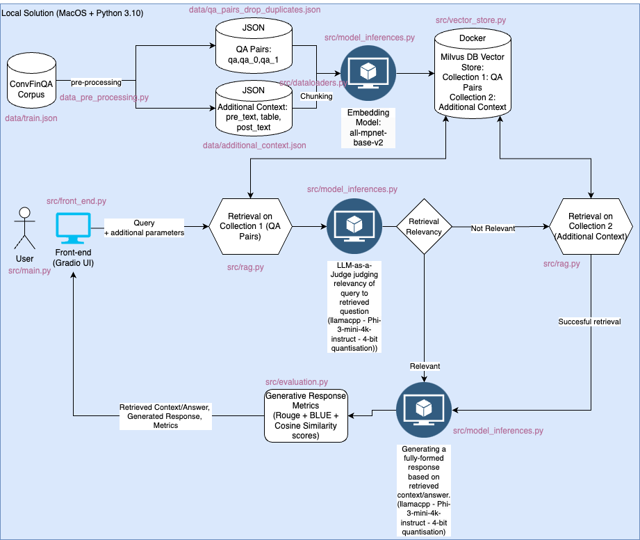

# convfinqa-submission
### Note: Code will be documented further.

## Solution Architecture

### For batch evaluation please refer to the testing folder, more documentation coming soon.

## Running the App:

1. Clone repository

2. Install requirements using:

    > pip install -r requirements.txt

    If using an accelerator, follow https://python.langchain.com/docs/integrations/llms/llamacpp/ to install llama-cpp with the necessary environment flags.

3. Make sure MilvusDB is up and running using docker.

    Source: https://milvus.io/docs/install_standalone-docker.md

    - Install docker and start daemon (https://www.docker.com).

    - Download the installation script
        > $ curl -sfL https://raw.githubusercontent.com/milvus-io/milvus/master/scripts/standalone_embed.sh -o standalone_embed.sh

    - Start the Docker container
        > $ bash standalone_embed.sh start

    - If needed, stop milvus and delete milvus data.
        > bash standalone_embed.sh stop
        > bash standalone_embed.sh delete

    '''
    A docker container named milvus has been started at port 19530.
    An embed etcd is installed along with Milvus in the same container and serves at port 2379. Its configuration file is mapped to embedEtcd.yaml in the current folder.
    To change the default Milvus configuration, add your settings to the user.yaml file in the current folder and then restart the service.
    The Milvus data volume is mapped to volumes/milvus in the current folder.

    Source: https://milvus.io/docs/install_standalone-docker.md
    '''

4. Download Phi-3 gguf file from https://huggingface.co/microsoft/Phi-3-mini-4k-instruct-gguf/blob/main/Phi-3-mini-4k-instruct-q4.gguf and add file to quantised_model/

5. Run app using:
    > python src/main.py

    - Note: If erroring on nltk download please run:
        > bash '/Applications/Python 3.10/Install Certificates.command'

# SOLUTION WALKTHROUGH​

1. Pre-process training data into 2 sets: question-answer pairs and additional raw context, removing duplicate values and dropping question-answer pairs that are contradicting ​
​
2. Embed, chunk and store corpora in Milvus database collections – hosted locally, using a milvus docker container.​
​
3. Using a python-based "Gradio" front-end the user can submit a query, and pass additional variables ( "retrieval only" and "enable output evaluation").​
​
4. Output is retrieved initially from the question-answer collection and the retrieved question is judged against the user query for relevancy, using a 4-bit quantised Phi-3-mini-4k-instruct model and a LangChain prompt chain.​
​
5. If relevant, a formal answer is then generated using the same quantised Phi-3 model and the equivalent prompt chain.​
​
6. If not relevant, a second retrieval process is invoked that searches within a larger context (pre-text, tables and post-text) and passes the retrieved output to the same quantised Phi-3 model, that generates a response using the equivalent chain.​
​
7. The output is then evaluated using Cosine Similiarity, Rouge and BLEU scores, giving us insight on retrieval and generation output quality.​
​
8. The retrieved context/answer, generative response and evaluation are then returned to the user, through our Gradio interface.
